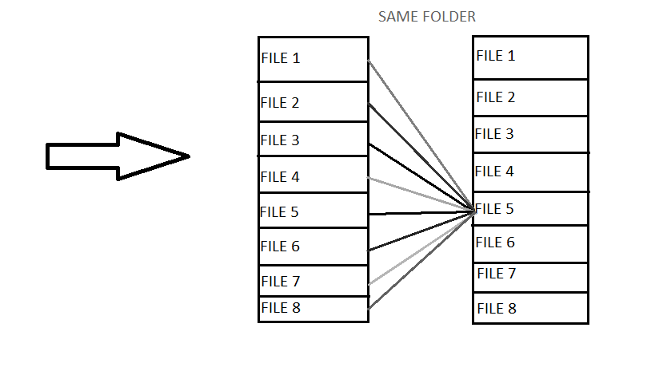

Self-attention Model:
Say the following sentence is an input sentence we want to translate,
”The animal didn't cross the street because it was too tired”

What does “it” in this sentence refer to? Is it referring to the street or to the animal? It’s a simple question to a human, but not as simple to an algorithm.

When the model is processing the word “it”, self-attention allows it to associate “it” with “animal”.

As the model processes each word (each position in the input sequence), self attention allows it to look at other positions in the input sequence for clues that can help lead to a better encoding for this word.

If you’re familiar with RNNs, think of how maintaining a hidden state allows an RNN to incorporate its representation of previous words/vectors it has processed with the current one it’s processing. Self-attention is the method the Transformer uses to bake the “understanding” of other relevant words into the one we’re currently processing.

Similarly, it could happen that if we make a change in a file it may affect the output of the other files which is called by the prevision file and may lead to a bug or if it doesn't then attention given to other files will be less as compared to the attention given to itself while predicting so the architecture will learn, whom it should give attention while giving the output, just like it does in the above problem.

So in order to implement this idea we group files based on Folder i.e, all files that are in the same folder are grouped in same group and we fed this input Tensor of dimension [Batch_size, Number_of_files_in_a_Folder, number_of_featues].
The Model output a one hot encoded tensor of dimension [Batch_size, number_of_Bugs]. 
In our case the model predict the number of bugs that may appear in upcomming month.(same as multi-class classification)

Hyperparameters: 

N : Number of encoders and decoders,

heads : Multi-Headed Attention,

lr : learning rate,

lr-decay,

wd : weight-decay, Hidden layer dimension in fully connected layer, probability of dropingout weights

Reference:

CODE : https://towardsdatascience.com/how-to-code-the-transformer-in-pytorch-24db27c8f9ec

MODEL : http://jalammar.github.io/illustrated-transformer/

TODO : 

Includes weigths in loss function for each class; Better Grouping fucntion; Model is not fully trained, so do experiment with the Hyperparamters.
